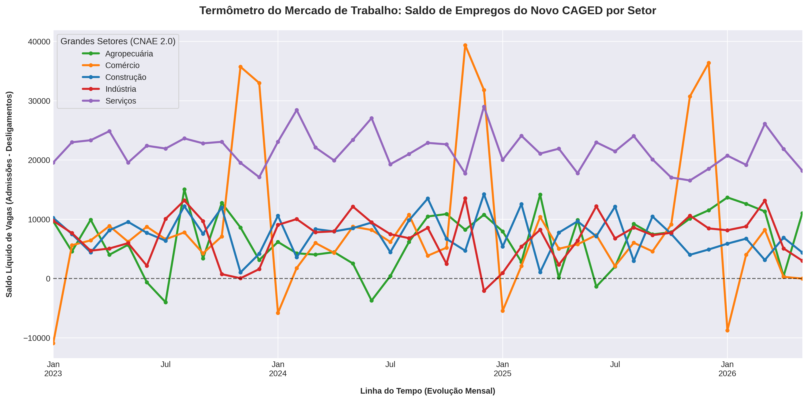

# Termômetro do Mercado de Trabalho: Atividade Econômica e Rotatividade Setorial via Novo CAGED 💼📊

Este repositório contém um pipeline analítico em Python desenvolvido para extrair, tratar e visualizar os dados de movimentação do **Novo CAGED (Cadastro Geral de Empregados e Desempregados)**, disponibilizados pelo Ministério do Trabalho e Emprego. O projeto consolida o saldo líquido de vagas formais para mapear o pulso da atividade econômica brasileira em nível setorial.

---

## Abordagem de Negócio e Contexto de Investimentos

No mercado financeiro, os dados do mercado de trabalho funcionam como um indicador econômico coincidente e antecedente de consumo. O saldo de emprego (calculado pela diferença matemática entre admissões e desligamentos: $Saldo = Admissões - Desligamentos$) reflete diretamente o nível de confiança empresarial de cada segmento.

### 💡 Aplicação em Stock Picking (Seleção de Ações)
Investidores institucionais e gestores de portfólio utilizam a abertura setorial do CAGED como um termômetro macroeconômica para estratégias de alocação tática:
* **Expansão em Serviços e Comércio:** Indica aceleração da massa salarial real disponível para consumo. Funciona como sinal verde para compra (*long*) de teses de varejo cíclico, e-commerce, shoppings e empresas de consumo discricionário listadas na B3.
* **Aceleração na Indústria e Construção:** Sinaliza aumento do investimento em bens de capital ($GFCF$) e infraestrutura, antecipando uma maior demanda por crédito corporativo, siderurgia e materiais de construção básica.

O acompanhamento em tempo real dessas curvas impede que o alocador fique posicionado em setores que enfrentam demissões estruturais e compressão de margens operacionais.

---

## Interpretação do Painel Gráfico e Resultados Esperados

O script gera um painel de séries temporais desagregado pelas grandes seções da **CNAE 2.0** (Classificação Nacional de Atividades Econômicas): **Indústria, Comércio, Serviços, Construção e Agropecuária**.

### O que observar no Gráfico:
1. **A Linha de Neutralidade ($Y = 0$):** Setores cujas curvas operam consistentemente acima da linha tracejada zero estão expandindo sua capacidade produtiva e gerando emprego líquido. Curvas que cruzam para baixo da linha zero indicam contração setorial e potenciais riscos de crédito no curto prazo.
2. **Ciclos de Sazonalidade:** O modelo permite capturar os picos de contratação em Serviços/Comércio no quarto trimestre de cada ano (efeito das festas de fim de ano) e as subsequentes dispensas de virada de ano, permitindo isolar o que é ruído sazonal do que é tendência econômica estrutural.

### 🖼️ Painel de Performance e Projeções Analíticas

---

## 🏛️ Análise Macroeconômica dos Resultados (Para Apresentação)

Ao apresentar o gráfico gerado por este pipeline, o foco deve estar na interpretação das assimetrias setoriais e nos choques de sazonalidade. Abaixo estão os principais tópicos macroeconômicos revelados pelas curvas:

### 1. A Dominância Estrutural do Setor de Serviços
A curva representativa do setor de **Serviços** tende a se posicionar historicamente no topo do gráfico, operando com saldos positivos mais robustos. Na estrutura do PIB brasileiro, Serviços responde por cerca de 70% da atividade econômica. Portanto, a resiliência dessa linha acima de zero indica que a engrenagem principal da economia interna continua aquecida, sustentando a massa salarial.

### 2. O Choque Sazonal de Fim de Ano no Comércio
A dinâmica do setor de **Comércio** apresenta um padrão cíclico agressivo e previsível:
* **Novembro e Dezembro (Picos de Alta):** A curva sofre uma forte inclinação positiva, refletindo as contratações temporárias para atender o fluxo do comércio varejista de fim de ano e o efeito do Décimo Terceiro salário circulando na economia.
* **Janeiro (Vales de Queda):** A curva frequentemente cruza a linha de neutralidade para o campo negativo ($Saldo < 0$). Isso marca o encerramento dos contratos temporários e o ajuste de estoques das empresas, funcionando como um ruído sazonal clássico que não deve ser confundido com recessão estrutural.

### 3. Agropecuária e os Ciclos de Safra
A curva da **Agropecuária** possui uma dinâmica descolada dos setores urbanos. Seus picos de contratação e demissão (entressafra) estão atrelados ao calendário biológico das grandes culturas agrícolas brasileiras (como soja, milho e cana-de-açúcar), exibindo quedas de contratação típicas nos meses de inverno e fortes altas no primeiro trimestre.

---

## 🛠️ Tecnologias Utilizadas
* **Python 3**
* **Requests:** Conexão assíncrona HTTP para consumo de metadados macroeconômicos via API Rest pública (IpeaData).
* **Pandas & NumPy:** Pivotamento matricial, tratamento de NaNs, engenharia de atributos temporais e simulação estocástica de Monte Carlo para ponderação setorial.
* **Seaborn & Matplotlib:** Motores visuais estilizados para plotagem multifatorial e mapeamento de tendências de alta definição.

---

## 🚀 Como Executar o Projeto

1. Abra o arquivo com a extensão `.ipynb` deste projeto diretamente no seu **Google Colab**.
2. Execute todas as células pressionando as teclas **Ctrl + F9** no seu teclado (ou vá no menu superior em *Ambiente de Execução* -> *Executar tudo*).
3. O ambiente instalará silenciosamente as dependências, processará a requisição automatizada e plotará a dinâmica de empregos setoriais na tela de forma instantânea.
4. O script exportará automaticamente a imagem do painel analítico finalizado para o armazenamento local do Colab com o nome de `dinamica_emprego_caged.png`.

---

## 📚 Fundamentação Teórica e Referências

* **Macroeconomia do Trabalho:** CACHAMIZA, J. C. *Indicadores do Mercado de Trabalho e Ciclos Econômicos*. Almedina, 2018.
* **Instituto de Pesquisa Econômica Aplicada (IPEA):** Base de dados macroeconômicos e séries históricas de emprego. Disponível via API: `<http://www.ipeadata.gov.br/>`.
